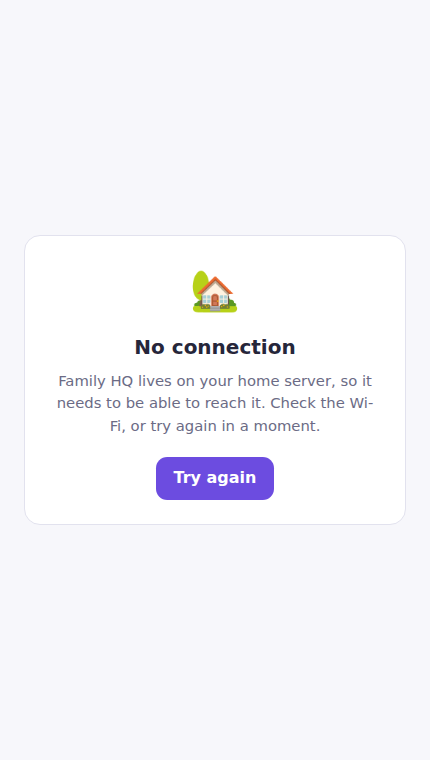
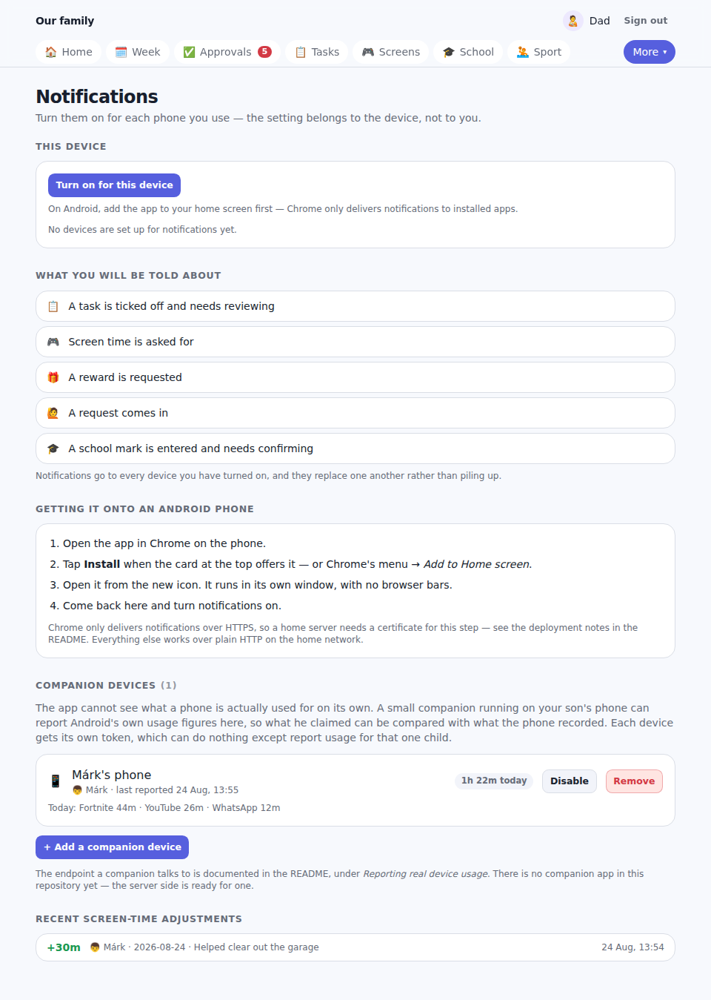
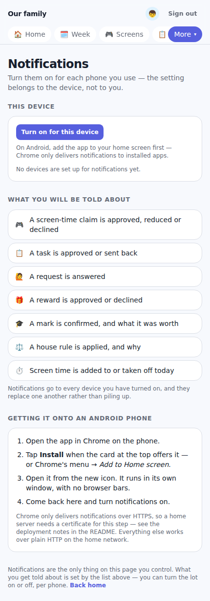
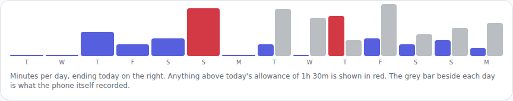
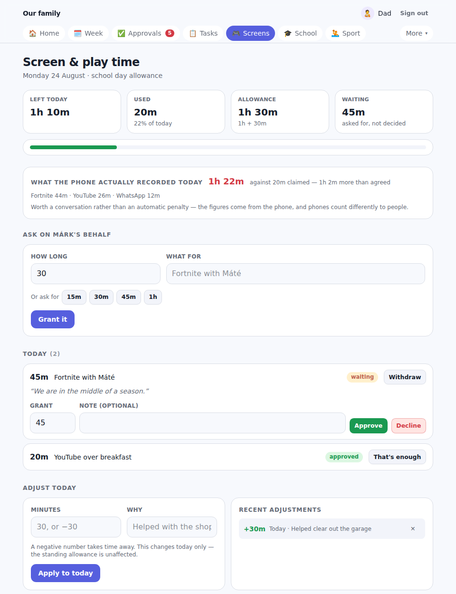

# Family HQ

A small self-hosted web app for running the practical side of bringing up a child: the tasks he's
agreed to do, the house rules that earn or cost something, how much screen time he has left, what
he can spend points and pocket money on, the things he wants to ask for, how school is going, how
sport is going, and what his week actually looks like.

It is one server and as many phones as your family has. The server holds a single SQLite file on a
machine you own; each phone installs from it and behaves like a normal Android app — its own icon,
its own window, and notifications. No accounts, no cloud, no third party holding your family's data.


---

## Contents

- [What it covers](#what-it-covers)
- [Running it](#running-it)
- [On a phone](#on-a-phone) — [installing](#installing-it-on-android) ·
  [notifications](#notifications) · [away from home](#reaching-it-from-outside-the-house) ·
  [real device usage](#reporting-real-device-usage)
- [Guide for parents](#guide-for-parents)
  — [Signing in](#signing-in) · [Setting up your family](#setting-up-your-family) ·
  [The dashboard](#the-dashboard) · [Approvals](#approvals-the-one-page-to-check) ·
  [Tasks](#tasks) · [House rules](#house-rules) · [Screen and play time](#screen-and-play-time) ·
  [School](#school) · [Sport](#sport) · [The week](#the-week) ·
  [Pocket money](#pocket-money) · [Rewards](#rewards) · [Activity](#activity)
- [Guide for your son](#guide-for-your-son)
- [How it's put together](#how-its-put-together) (for developers)

---

## What it covers

| Section | What it's for |
| ------- | ------------- |
| **Tasks** | Chores, homework and habits — one-off or repeating, worth points and/or money |
| **House rules** | Standing agreements you apply with one tap, for good and for bad |
| **Screen time** | A daily allowance he claims against and you decide on |
| **School** | Subjects per term, marks with weighted averages, upcoming exams |
| **Sport** | Training and matches: attendance, results, coach feedback, season totals |
| **The week** | School and sport on one timetable, browsable week by week |
| **Pocket money** | Automatic allowance, performance bonus, savings goals |
| **Rewards** | A shop priced in points, money, or both — some of it screen time |
| **Requests** | He asks for something and has to say why; you answer with a note |
| **Activity** | Every point and every cent, with the reason it moved |
| **Notifications** | A claim or an answer reaching the other person's phone without either of you opening the app |

---

## Running it

Requires Node 20.9 or newer.

```bash
npm install
npm run dev            # http://localhost:3000
```

To explore with realistic data first:

```bash
npm run seed           # creates Dad (PIN 1234) and Márk (PIN 1111)
```

That gives you a fortnight of ticked-off chores and screen-time claims, a term of school marks, a
full school and waterpolo timetable, written-up training sessions and a match, and a few things
waiting for a decision. `npm run seed -- --force` wipes and reseeds; `npm run reset` deletes the
database so the setup screen comes back. Both replace the database file, so restart the app
afterwards.

### For real use at home

```bash
npm run build
npm start
```

Put it on a machine that stays on — a spare laptop, a Raspberry Pi, a small VPS — and reach it from
the phones on your home network. It's a plain web app, so "add to home screen" gives each of you an
icon that behaves like a native one.

| Variable        | Default             | What it's for                                                   |
| --------------- | ------------------- | --------------------------------------------------------------- |
| `DATABASE_PATH` | `data/family.db`    | Where the SQLite file lives. Point it at a backed-up directory.  |
| `APP_SECRET`    | generated on demand | Signs session cookies. Set it explicitly in production.          |
| `PORT`          | `3000`              | Port for `npm start`.                                            |
| `VAPID_PUBLIC_KEY`  | generated on demand | Web Push key pair. Pin both before moving the database.      |
| `VAPID_PRIVATE_KEY` | generated on demand | Changing them invalidates every subscription.                |
| `PUSH_CONTACT`  | `mailto:family-hq@localhost` | Contact address sent with each push, per the VAPID spec. |

If `APP_SECRET` isn't set, a random one is generated once and kept in `data/.session-secret`, so
sessions survive restarts without any configuration.

**Back up `data/`.** That single directory is the whole application state.

Sessions are cookies signed with HMAC-SHA256 and PINs are hashed with scrypt, but this is built for
a home network. If you expose it to the internet, put it behind HTTPS — the session cookie is only
marked `Secure` when `NODE_ENV=production`, and a PIN is a PIN.

The whole app follows your phone's light or dark setting:


---

# On a phone

The app is built to be used from a phone and administered from anywhere. Installed, it gets a
launcher icon and runs without browser bars; the server it talks to is yours.

## Installing it on Android

1. Open the app in **Chrome** on the phone.
2. Tap **Install** on the card at the top of the page — or Chrome's menu → *Add to Home screen*.
3. Open it from the new icon.

That's it. It is a real installed app as far as Android is concerned: its own icon, its own task in
the app switcher, its own storage. The three long-press shortcuts on the icon go straight to
Approvals, Screen time and The week.

**Installing needs HTTPS.** Over plain `http://` on your home network the app works perfectly, but
Chrome will not offer to install it and will not deliver notifications. See
[away from home](#reaching-it-from-outside-the-house) for the two easy ways to get a real
certificate — both of which also solve using it away from the house.

With no connection it says so plainly instead of showing a browser error:



Nothing that could contain family data is ever cached on the phone — see
[what the service worker does](#what-the-service-worker-caches-and-why) for why that is deliberate.

## Notifications

Each person turns notifications on per phone, from the **Notifications** page under *More*.



The page lists exactly what will be sent, which differs by role:

| A parent is told when | Your son is told when |
| --- | --- |
| A task is ticked off and needs reviewing | A screen-time claim is approved, reduced or declined |
| Screen time is asked for | A task is approved or sent back |
| A reward is requested | A request is answered |
| A request comes in | A reward is approved or declined |
| A school mark is entered and needs confirming | A mark is confirmed, and what it was worth |
| | A house rule is applied, and why |
| | Screen time is added to or taken off today |

Tapping a notification opens the right page — an approval lands you in the queue, a decision lands
him on his screen-time page. Notifications of the same kind replace one another rather than piling
up, so a busy afternoon doesn't leave you with fourteen of them.

There is a **Send a test notification** button once a device is set up, which is worth using before
you rely on it.



A few practical notes:

- The setting belongs to the **device**, not to the person. A parent with a phone and a laptop turns
  it on twice, and gets both.
- Notifications are a courtesy, never a precondition. If delivery fails, the thing that caused it
  still happened — the approval is still in the queue.
- If a phone is wiped or the browser clears its data, its subscription goes stale. The server
  notices the first time it fails permanently and removes it.

## Reaching it from outside the house

Two things want the same solution: using the app when you're not on the home Wi-Fi, and getting the
HTTPS certificate that installing and notifications need. Pick whichever you find easier.

**Tailscale** — a private network between your own devices, nothing exposed to the internet.
Install it on the server and on each phone, then let it terminate TLS for you:

```bash
tailscale serve --bg 3000        # serves the app at https://<machine>.<tailnet>.ts.net
```

The certificate is real and trusted, so Chrome will install the app and deliver push. Your family
reaches it from anywhere they can reach the tailnet, and nobody else can reach it at all. This is
the recommended option for a family app.

**Cloudflare Tunnel** — a public hostname without opening a port:

```bash
cloudflared tunnel --url http://localhost:3000
```

Convenient, and gives you a name you can type. Traffic passes through Cloudflare, which is worth
knowing when the traffic is your child's school marks.

**Your own domain and a reverse proxy** — if you already run one. With Caddy the whole config is:

```caddyfile
family.example.com {
    reverse_proxy localhost:3000
}
```

Caddy gets and renews the certificate itself. This needs port 443 reachable, so it is the option
that actually puts something on the internet — put it behind Tailscale or an allowlist if you can.

Whichever you choose:

```bash
npm run build
APP_SECRET=$(openssl rand -hex 32) PORT=3000 npm start
```

Set `APP_SECRET` explicitly once you have more than one machine involved, so sessions survive a
move. The session cookie is marked `Secure` in production, which means the browser will only send
it over HTTPS — so terminate TLS properly rather than half-way.

## Reporting real device usage

The app cannot see what a phone is actually used for. It knows what was *claimed* and what was
*granted*, which is the agreement — not the reality.

If you want the reality alongside it, the server accepts reports from a companion app running on
the phone. When one is set up, the screen-time page shows both figures:


and the two-week chart gains a grey bar per day for what the phone recorded:





### Setting up a device

A parent creates a token on the **Notifications** page → *Companion devices*. It is shown once and
stored only as a SHA-256 hash, so it cannot be recovered — if you lose it, remove the device and
add another. A token identifies one device belonging to one child and can do nothing else: it
cannot read the ledger, approve anything, or see another child.

### The endpoint

Both calls authenticate with `Authorization: Bearer <token>`.

**`GET /api/usage`** — what the server thinks of today. Useful for showing the budget natively:

```json
{
  "device": { "id": 1, "name": "Márk's phone" },
  "timezone": "Europe/Budapest",
  "date": "2026-08-24",
  "tracking": true,
  "allowanceMinutes": 95,
  "usedMinutes": 20,
  "remainingMinutes": 75,
  "awaitingMinutes": 45,
  "recordedMinutes": 82
}
```

**`POST /api/usage`** — report a day, or a batch of days after being offline:

```jsonc
// one day
{ "date": "2026-08-24", "minutes": 82,
  "apps": [{ "name": "Fortnite", "minutes": 44 }, { "name": "YouTube", "minutes": 26 }] }

// or several
{ "days": [ { "date": "2026-08-23", "minutes": 71 }, { "date": "2026-08-24", "minutes": 82 } ] }
```

`date` defaults to today and `apps` is optional. Re-posting a day replaces it, so a companion can
report as often as it likes. The server refuses future dates, negative or absurd minute counts,
malformed dates, batches over 60 days, and bodies over 16 KB; it keeps only the `name`/`minutes`
shape from `apps`, capped at the 20 biggest, so a companion cannot use the field as general
storage. A disabled or removed device gets `401` immediately.

### Writing the companion

There is **no companion app in this repository** — the server side is ready for one. On Android it
would need:

- The `PACKAGE_USAGE_STATS` permission, which the user grants by hand in Settings → Special app
  access → Usage access. It cannot be granted silently.
- `UsageStatsManager.queryAndAggregateUsageStats` for per-app foreground totals.
- A `WorkManager` job posting once or twice a day.

Worth being clear about the limits before building it: Android will report usage, but it will not
let an ordinary app *block* anything. Enforcement needs Family Link or a device-owner setup, which
is a different and much larger undertaking. What this buys you is an honest number to talk about,
which in practice is most of the value.

---

# Guide for parents

## Signing in

The very first time you open the app, there is nothing in it. It asks you to name the family and
pick your own PIN — that account becomes the first parent.


After that, signing in is two taps: pick your face, type your PIN. Everyone in the family gets
their own profile and their own PIN, and what you see depends on which one you signed in as.

| Pick a profile | Enter the PIN |
| --- | --- |
|  |  |

A session lasts 30 days, so on your own phone you sign in roughly once a month.

## Setting up your family

**Family** (under *More*) is where you add people. Give each child a name, an emoji they'll
recognise, a colour, and a PIN. You can set their weekly pocket money here too, or leave it for
later.


The same page holds the settings that change how the app talks:

- **What to call points** — "points", "stars", "credits", whatever works in your house.
- **Currency symbol** and whether it goes before or after the amount.
- **Timezone** — this decides when a day ends, so it controls when tasks count as missed and when
  pocket money is released.
- **The grading scale** — defaults to the Hungarian 1–5. Set the worst and best mark, and say which
  end is better, so German-style 1–6 scales work too.

Archiving a member keeps all their history but stops them signing in. There must always be at least
one parent, so the app won't let you archive or demote the last one.

## The dashboard

Home is the day at a glance. If anything is waiting on you, it says so at the top and links
straight through.


Each child gets a card, and it's worth knowing what's on it:


- Points balance and spendable pocket money, top right.
- Today's task progress, and how many were missed.
- The little bars are points per day over the last fortnight — red days are ones that cost points.
- Screen time left today, with a link if he's asked for more.
- **Next:** the next thing on his calendar, school or sport.
- Two collapsed lists: today's timetable and today's outstanding tasks — you can tick tasks off
  from here without leaving the page.
- The house-rule buttons, for one-tap enforcement (see below).

Underneath the cards is a one-line form for adding a one-off task for today, for when something
comes up.

## Approvals: the one page to check

If you only look at one page a day, look at this one. Everything waiting on a decision is here, in
one queue, with a badge on the nav showing the count. With
[notifications](#notifications) turned on you don't have to remember to look — each of these
arrives on your phone as it happens, and tapping it lands you here.


Five kinds of thing turn up, in this order:

**1. Completed tasks.** He says he's done it; you approve, send it back, or skip it. You can change
the points before approving — a job done properly can be worth more than the standing rate.


**2. Screen time.** He's asked for minutes. Lower the number to grant less than he asked for, or
decline with a reason.

**3. School marks he entered himself.** These don't count towards any average until you confirm
them, and confirming is where you decide whether the mark is worth points. The suggested figure is a
starting point, not a rule.

**4. Reward requests.** He wants to spend points or money on something from the shop. The cost is
checked again at this moment, so he can't spend the same points twice.

**5. Requests.** Permission, money, a purchase, or anything else. You answer with a note, and both
of you can point back at it later.

## Tasks

A task is a definition — what, who, how often, worth how much — and the app turns it into a dated
occurrence he can tick off each day it's due.


The fields that matter:

- **Repeats** — one-off, every day, school days, or specific weekdays.
- **Due by** — the time after which an untouched task counts as missed.
- **Points** and **Money** — either, both, or neither.
- **Missed penalty** — points docked if the day passes without it being done. Leave it at zero for
  anything you'd rather not make a battle.
- **Trust it** — pays out the moment he ticks it off, with no review from you. Good for the small
  daily things; keeps your approvals queue for the things that need judgement.

Tasks can be **paused** rather than deleted, which stops new occurrences without losing the
history. Deleting removes the task and its occurrences, but the points he already earned stay on
his balance — the ledger is never rewritten.

If a task is missed and the penalty applies, but he does it late and you approve it anyway, **the
penalty is handed back automatically.**

Below the list is the next seven days, so you can see what's coming and tick things off for any
child. Future days show "not yet" instead of a button — nobody can bank tomorrow's chores today.

## House rules

These are the standing agreements: the things that reliably earn something and the things that
reliably cost something. Write them down once, together, and then applying one is a single tap.


Each rule has a size in points and/or money, and can apply to everyone or to one child. Add a note
when you apply it — "before school" — and it shows up in the history so the *why* survives.

Every application is listed under **Recently applied** with an **Undo** button, which posts the
mirror-image entries and gives the points back. Rules can be turned off without being deleted.

The point of doing it this way: he can read the list. The consequence for a rude answer isn't your
mood that day, it's the number next to the rule.

## Screen and play time

A daily allowance, different on school days and at the weekend. He claims against it; you decide.


The four tiles are **left today**, **used**, today's **allowance** (and how it was adjusted), and
how much is **waiting** on you.

When he asks, you get three options rather than two — approve, **grant less than he asked for**, or
decline with a reason:


**Adjust today** changes a single day without touching the standing allowance: `+30` for helping
with the garage, `-15` for leaving the tablet on the stairs. Each adjustment is listed and can be
undone.

If a session is already running and you decide that's enough, **That's enough** ends it and returns
the unused minutes to the day.

The settings are where the policy lives:


- **School day / weekend day minutes** — Saturday and Sunday use the weekend figure.
- **Goes through without asking, up to** — set this to 30 and a quick half hour needs no
  permission. Set it to 0 and everything comes to you.
- **Today's tasks first** — while any of today's tasks are outstanding, *every* claim comes to you
  regardless of size. He can see this on his own screen, so it isn't a surprise.

Approved minutes come off the day they were claimed on, and nothing carries over to tomorrow.

> **This does not enforce anything on the devices themselves.** It is the agreement and the record,
> not a network filter. It works because you're both looking at the same number.

## School

Set up a term, add the subjects he takes in it, and record marks against them.


Each subject shows its weighted average — on your own grading scale and as a percentage — with a
colour so a subject that's slipping is obvious.


Recording a mark takes a few seconds:


- **Mark** and **Out of** — a mark stores both, so a 4/5 and an 87/100 sit in the same list and
  still average correctly. Leave "out of" at your scale's maximum for ordinary marks.
- **Counts** — the weight. A big end-of-topic test can count double or triple.
- **Points to award** — optional. A good mark can be worth points, which feed his pocket-money
  bonus.

He can enter his own marks. Those arrive unconfirmed, don't count towards any average, and wait in
your approvals queue — which keeps the record honest without making you the only one who types.

**Exams** aren't recorded here; they live on the week's timetable, and the four-week list of what's
coming appears at the top of this page.

## Sport

A profile for the sport, club, coach and season, then a write-up per session.


The header carries the season totals: attendance rate, win/draw/loss, goals, average coach rating.

Sessions that have **finished** without being written up are listed at the top, expanded and ready,
so nothing quietly disappears. One form closes a session off:


Attendance, score, goals, assists, minutes, a coach rating out of five, the coach's feedback in
their own words, and his own note. A parent can attach points.

The result reads back as a record you can look through at the end of a season:


Regular training belongs in the weekly timetable; matches and tournaments are added there as
one-offs.

## The week

School and sport on one page, day by day, with arrows to move between weeks.


Colours down the left edge separate lessons, exams, training, matches and tournaments. Today's
column is highlighted.


Once something has finished, its attendance can be recorded from the day it sits on — "Were you
there?" with Yes / No / Excused, and a link through to write a sport session up properly. It only
asks once the session has actually ended, so this morning it won't ask about tonight's training.

**Repeats every week** is the timetable itself. Add a lesson or a regular training session with a
day, a time and a place:


Linking a lesson to a subject ties it to that subject's marks. Slots are bounded by dates (they
default to the term you're in), and can be paused. Occurrences are generated eight weeks ahead, so
you can look forward.

**Add something one-off** covers exams, matches, tournaments and extra sessions — anything on a
specific date rather than every week.

## Pocket money


The allowance runs itself:


- **Base amount** and **how often** — weekly or monthly.
- **Payday** — 1–7 for Monday–Sunday, or a day of the month.
- **Bonus per point** — an extra amount for every point earned in the period. This is what ties
  chores, house rules, school marks and sport back to real money.
- **Minimum points for the base** — below this, the base is withheld for that period. The bonus
  still applies. Use it sparingly.

Money paid is money paid: allowances only ever pay the *current* period, so if the app sits unused
for three weeks it won't suddenly release three weeks of back-pay.

**Savings goals** take money out of his spendable balance until the goal is bought or cancelled, so
the number he sees as "to spend" is honest. **One-off adjustment** hands out or takes back points
and money outside any rule, with a reason he can read.

**Where it came from** is the ledger for that child — every movement with its cause.

## Rewards

The shop. Price things in points, money, or both.


- **Stock** limits how many times something can be redeemed. Leave it blank for unlimited.
- **For** restricts a reward to one child.
- **Adds screen time** hands over extra minutes when the reward is redeemed — which is how "an
  extra hour of screen time" actually becomes an extra hour.

He asks, you approve, the balance is charged. Rewards can be hidden without being deleted.

## Activity

Every point and every cent, newest first, with the reason and the source: task, house rule, reward,
request, pocket money, savings goal, school mark, sport, or a manual adjustment.


Balances are calculated from this log rather than stored, so the history and the numbers can never
disagree.

---

# Guide for your son

*This half is written to be read by the child, or read out to them.*

## Signing in

Tap your face, type your PIN. That's it. If you get the PIN wrong it just says so — nothing
happens, try again.


Ask a parent if you want to change your PIN — it's on the Family page, and you'll need to know your
current one.

## Home

Everything you need for today, in the order you'll want it.


At the top: your points, how much money you have to spend, how many of today's tasks are done, and
how much screen time you've got left. Then a big tap-through for screen time, today's timetable,
today's tasks, anything you're waiting on a parent for, and your last two weeks of points.

## Your screen time


**Left today** is the number that matters. Ask for time by typing how long and what for, or tap one
of the quick buttons:


Some things are worth knowing:

- **Green quick buttons go through on their own.** If a button is green, that amount doesn't need
  anyone's permission — tap it and it's yours.
- If your parents have switched on **tasks first**, you'll see a note saying so. While today's
  tasks aren't done, every request has to be asked for, however small.
- You can't ask for more than you have left. The app will tell you what's actually available.
- A parent can say yes, say no, or **give you less than you asked for** — 40 minutes instead of 60.
  If they leave a reason, you'll see it.
- **Withdraw** takes back a request you've changed your mind about.
- It resets every day. Nothing carries over, so there's no point hoarding it.

The chart shows what you actually used over the last fortnight.

## Your tasks


Today's jobs are at the top. Tap **I did it** and it either lands straight away or goes to a parent
to check — depends on the task.

- **Waiting for review** means a parent hasn't looked yet. **Undo** takes it back if you tapped by
  mistake.
- **Missed** means the time passed. If there was a penalty, you lost those points — but you can
  still tap **Done late**, and if a parent approves it **you get the penalty back**. Late is much
  better than never.
- **Not accepted** means a parent sent it back. There's usually a note saying why. Fix it and tap
  again.
- Tasks further down the week say **not yet** instead of a button. You can't do Thursday's job on
  Monday.

## Your week


Lessons, training, exams and matches, all in one place. Use the arrows to look ahead.

After a training session or a match, the app asks **"Were you there?"** — answer honestly. It only
asks once the session has actually finished.

You can add a one-off yourself: an exam a teacher just announced, or an extra session. You can
remove things you added, but not lessons or training a parent set up.

## Your school marks


Every subject with its average, and every mark that went into it. A mark counting **2×** pulls the
average twice as hard.

You can add marks yourself as soon as you get them — tap **+ Record a mark**, put in what you got
and what it was out of. It'll say **to confirm** until a parent checks it, and it doesn't move your
average until then. Adding it yourself is still worth doing: it's how the good ones get noticed.

## Your sport


Your attendance, your record, your goals, your average coach rating, and what's coming up. Sessions
that need writing up are at the top — you can fill in your own note, and the coach's feedback ends
up here too, so you can look back at what they actually said.

## The reward shop


Things you can spend points and money on. If a button says **Not enough yet**, you can see exactly
how far off you are. **Ask to redeem** sends it to a parent — you can add a note to make your case.

Some rewards give you screen time. Those say so.

## Asking for something


For anything that isn't in the shop: permission to go somewhere, money for a school trip, something
you want to buy, extra screen time.

**Say why.** The "why" box is the part that actually works. Who, where, until when, how you'll get
home. A request with a real answer in it gets a yes far more often than "can I go out".

Your parent's answer is saved next to your question, so neither of you has to remember what was
agreed.

## Getting told things


Under **More → Notifications** there is one button: turn them on for this phone. Then you find out
when a parent answers, without having to keep opening the app and checking.

You'll be told when a screen-time request is decided — including if you were given less than you
asked for and why — when a task is approved or sent back, when a request is answered, when a mark is
confirmed and what it was worth, and when a house rule is applied. Tapping the notification opens
the right page.

You have to add the app to your home screen first, and turn it on again on each phone you use.

## Your money


**To spend** is what you can actually use right now. **In goals** is money you've put aside for
something — it's still yours, it just isn't spendable until you take it out again or buy the thing.

Set up a savings goal for something big, then move money into it as you earn. **Where it came from**
lists every single amount and why you got it.

---

## How it's put together

| Path                | What's in it                                                              |
| ------------------- | ------------------------------------------------------------------------- |
| `src/lib/schema.sql`| The whole data model, commented. Start here.                              |
| `src/lib/migrations/` | Numbered SQL files that bring an older database up to that shape.       |
| `src/lib/ledger.ts` | Balances, goal reservations, penalty reversals.                           |
| `src/lib/grades.ts` | Turning marks on any scale into comparable numbers and averages.          |
| `src/lib/screens.ts` | The day's screen-time arithmetic: allowance, adjustments, what's left.   |
| `src/lib/push.ts`   | VAPID keys, subscriptions, and sending a Web Push message.                 |
| `src/lib/notify.ts` | Every notification the app sends, in one readable list.                    |
| `src/lib/devices.ts` | Companion device tokens and the usage they report.                        |
| `src/app/api/usage/` | The only HTTP API: what a companion app talks to.                         |
| `public/sw.js`      | The service worker — offline fallback and push handling.                    |
| `src/lib/scheduler.ts` | Creates task and timetable occurrences, closes overdue ones, pays allowances. |
| `src/lib/queries.ts`| Every read the pages perform.                                             |
| `src/actions/`      | Server actions — one file per area, each doing its own permission check.  |
| `src/app/(app)/`    | The signed-in pages; `src/app/login/` is everything before that.          |
| `src/components/`   | Shared UI, including the shared task row and the one-tap house-rule bar.  |

Next.js (App Router) with server actions, SQLite via `better-sqlite3`, and Tailwind. There is no
API layer and no client-side store: pages read the database directly and actions write to it.

Three conventions worth knowing before you change anything:

- **Money is always integer minor units** (cents/fillér) end to end. It's only turned into a string
  at the edge, by `formatMoney`.
- **Balances are never stored.** They're `SUM(amount)` over the `ledger` table. If you add a way for
  points or money to move, post a ledger entry rather than updating a running total.
- **Recurring things are a definition plus dated occurrences.** `tasks` → `task_instances` and
  `schedule_slots` → `schedule_events` follow the same shape: the definition holds the rule, the
  occurrence holds what actually happened on the day. Anything you can tick, miss or write up hangs
  off the occurrence.

### What the service worker caches, and why

Every page in this app is rendered for whoever is signed in. Caching HTML or React payloads on the
device would risk showing one person's balance to another, so `public/sw.js` caches **only**
content-addressed build output (`/_next/static/*`), the icons, the manifest and a static offline
page. Navigations always go to the network, and fall back to the offline page when there is none.
`GET` is the only method it touches, so server actions and the API are never intercepted.

The cost is that the app needs a connection to show anything real. For a family app whose whole
point is a shared, current number, that is the right trade.

### Notifications

`src/lib/notify.ts` holds the whole set, one function per event, so what the app sends can be read
at a glance. Nothing there is awaited and nothing throws: a notification is a courtesy, never a
precondition for the change that caused it. `push()` fires and forgets; a permanently failing
endpoint (404/410) is deleted, anything else has its failure count bumped.

The VAPID key pair is generated on first use and stored in `settings`, so a home install needs no
configuration. Set `VAPID_PUBLIC_KEY` and `VAPID_PRIVATE_KEY` to pin it instead — worth doing before
you move the database between machines, since changing the keys invalidates every subscription.

### Who may do what

Every server action does its own check rather than trusting the page that called it. The shape of
it: a parent may do anything; a child may act on their own records only.

Children can tick off tasks, claim screen time, enter marks, record attendance, ask for things, and
move their own money between goals. They cannot award points, confirm marks, decide claims, change
any allowance or budget, edit the timetable, or delete anything they didn't create. Marks a child
enters stay unconfirmed and uncounted until a parent confirms them.

### Scheduled work without a scheduler

There's no cron job. `runMaintenance()` runs in the signed-in layout on page load and is throttled
to once every 20 seconds. It creates occurrences ahead of time, marks overdue ones missed, and
releases pocket money whose payday has arrived.

The consequence worth knowing: **things happen when someone opens the app**, not at midnight. If
nobody opens it for three days, those three days of misses are all recorded the moment someone does.
Allowances only ever pay the current period, so a long gap can't release a burst of back-payments —
a missed week stays missed rather than arriving late.

Occurrences are never created for dates before a task or timetable slot was added, so setting an old
start date can't generate a pile of retroactive misses — or a month of training sessions asking to be
written up. Lessons and training are generated eight weeks ahead so the week view can be browsed
forward.

### Changing the database

`schema.sql` is always the current shape and is applied whole to a new database; it carries its own
`PRAGMA user_version`. An existing database is brought forward by the numbered files in
`src/lib/migrations/`, run once each on startup inside a transaction, with a foreign-key check
afterwards. When you change the schema: edit `schema.sql`, bump its `user_version`, add the matching
migration, and add it to the list in `db.ts`. The app refuses to start if those drift apart.

---

## Things it deliberately doesn't do

No notifications or reminders — that's the parent's job, and a nagging app gets muted.
No photo proof for tasks; a note field is enough and keeps the database small.
No leaderboards between siblings.
No importing from the school's own system — marks are typed in, which takes seconds and means the
two of you look at them together.
No enforcement of screen time on the actual devices — the app is the agreement and the record, not a
network filter. A companion can *report* what a phone did; Android will not let an ordinary app stop
it.
No offline use beyond a polite "no connection" screen. Every number here is shared and current, and
a stale copy of someone's balance is worse than no copy.
No native Android app. The installed web app covers everything except reading device usage, and a
second codebase is a lot to maintain for one screen.
