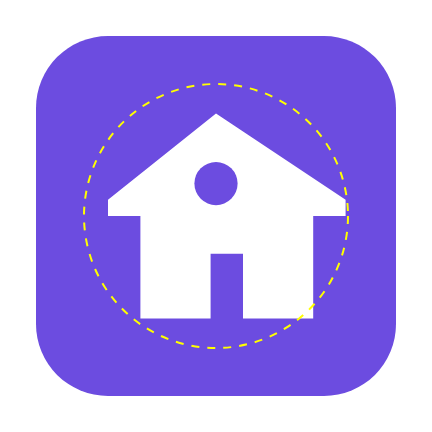

# The Android app

This is the Family HQ client you can publish to Google Play. It is small on
purpose — around 1,400 lines of Kotlin, comments included — because almost
everything it shows is the web app itself.

It does three things a web page cannot:

1. **Puts an icon on the home screen** that came from the Play Store, so
   installing it is something you do for the family rather than something you
   talk a twelve-year-old through in a browser menu.
2. **Reads how long the phone has actually been used**, per app, and reports it
   to your server. This is the whole reason the app is native.
3. **Shows notifications as Family HQ** rather than as Chrome.

Everything else — tasks, approvals, screen time, school, sport, pocket money —
is the same web app, rendered by Chrome's engine with the browser interface
removed. That is a *Trusted Web Activity*, and it means there is exactly one
copy of every screen to maintain.

## Contents

- [How it fits together](#how-it-fits-together)
- [What it reads, and what it does not](#what-it-reads-and-what-it-does-not)
- [Building it](#building-it)
- [Signing](#signing)
- [Pointing it at your server](#pointing-it-at-your-server)
- [Verifying the app owns your site](#verifying-the-app-owns-your-site)
- [Setting it up on a phone](#setting-it-up-on-a-phone)
- [Releasing through GitHub Actions](#releasing-through-github-actions)
- [Publishing to Google Play](#publishing-to-google-play)
- [The launcher icon](#the-launcher-icon)
- [What has and has not been tested](#what-has-and-has-not-been-tested)
- [The files](#the-files)

## How it fits together

```
launcher icon
     │
     ▼
MainActivity ─── no server address yet? ──▶ SetupActivity   (Compose, native)
     │                                          │
     │  address saved                           │  saves address + device token,
     ▼                                          │  walks you through usage access
TwaActivity ──▶ Chrome, no browser UI ──▶ https://your-server/
                                                │
WorkManager, every 6 hours                      │
     │                                          │
     ▼                                          ▼
UsageReader ──▶ UsageReporter ──▶ POST https://your-server/api/usage
```

The app has no database, no cache and no state beyond five values in
`SharedPreferences`: the server address, the device token, the server's
timezone, when the last report succeeded, and what it said.

## What it reads, and what it does not

It reads, for each day, how many minutes each app with a launcher icon spent in
the foreground. That is it. It sends those numbers, and only those numbers, to
the one server address you typed in.

It does not read messages, notifications, keystrokes, browsing history, location,
contacts, photos, or the contents of any app. It has no analytics, no crash
reporter, no advertising identifier, and talks to nothing on the internet except
your server. There is no third-party SDK in it at all: the dependencies are
AndroidX, Jetpack Compose, and Google's Trusted Web Activity helper.

Apps without a launcher icon are skipped, which keeps the system's own
components out of the numbers and means the app does not need
`QUERY_ALL_PACKAGES` — a permission Google Play requires a separate declaration
for, and which would give it far more visibility than it needs.

**Days are the server's days.** The phone asks the server what day it is and
where its timezone is before it counts anything, so a day means the same thing
on both sides even when the phone is travelling.

## Building it

You need JDK 17 and the Android SDK. Android Studio (Ladybug or newer) brings
both; on the command line, `ANDROID_HOME` needs to point at an SDK with platform
35 and the build tools installed.

```bash
cd android
./gradlew assembleDebug          # an APK you can sideload, applicationId ends .debug
./gradlew bundleRelease          # the .aab you upload to Play — needs signing, see below
./gradlew installDebug           # straight onto a connected phone
```

The debug build uses a different application ID (`…​.debug`), so it can sit on
the same phone as the released app without either replacing the other.

## Signing

Google Play identifies your app forever by the certificate you sign it with.
Lose the keystore and you cannot ship an update — the only remedy is a new
listing under a new package name.

Make one:

```bash
keytool -genkeypair -v \
  -keystore ~/familyhq-release.jks \
  -alias familyhq \
  -keyalg RSA -keysize 4096 -validity 10000
```

Then tell Gradle where it is, in `android/keystore.properties` — which
`.gitignore` already excludes, and which must stay excluded:

```properties
storeFile=/home/you/familyhq-release.jks
storePassword=…
keyAlias=familyhq
keyPassword=…
```

Back the keystore up somewhere that is not this repository and not the machine
you build on.

A release build refuses to start if this file is missing, or if the application
ID still contains `example` — both are mistakes that are painful to discover
after an upload rather than before one.

## Pointing it at your server

Two values in `android/gradle.properties`:

```properties
# Cannot be changed after your first upload to Play. Use a domain you own.
familyhq.applicationId=com.yourname.familyhq

# Where your server is. Host only, no https://.
familyhq.host=family.example.com
```

Both can be overridden per build: `./gradlew bundleRelease
-Pfamilyhq.host=family.example.com`.

Leaving `familyhq.host` blank is allowed — the app then asks for the address on
first run. It is worth setting for a family build, so nobody has to type a
hostname on a phone keyboard.

## Verifying the app owns your site

Until your server vouches for the app, Chrome will not give it the full window:
it opens as a Custom Tab with the address bar showing. That is deliberate on
Android's part, and it is the right default — an unverified app has no business
hiding whose page it is displaying.

The server already serves the file that fixes this, at
`/.well-known/assetlinks.json`. It needs two environment variables:

```bash
ANDROID_PACKAGE_NAME=com.yourname.familyhq
ANDROID_CERT_FINGERPRINTS=AB:CD:…:EF
```

The fingerprint is the SHA-256 of the signing certificate, as 32 uppercase hex
pairs separated by colons. Get it from your keystore:

```bash
keytool -list -v -keystore ~/familyhq-release.jks -alias familyhq | grep -A1 SHA256
```

**If you use Play App Signing** — and you will, because it is mandatory for new
apps — Google re-signs your upload with *its own* key, and that is the
certificate the phone sees. List both: your upload key and the one Play shows
under Release → Setup → App signing. Separate them with a comma:

```bash
ANDROID_CERT_FINGERPRINTS=AB:CD:…:EF,12:34:…:90
```

Check it from anywhere:

```bash
curl -s https://family.example.com/.well-known/assetlinks.json
```

An empty `[]` means the variables are not set. A malformed fingerprint is
dropped with a warning in the server log rather than published — a typo here
otherwise shows up only as "the app has an address bar and nobody knows why".

Android caches the result, so after fixing it, reinstall the app or clear
Chrome's storage to force a re-check.

## Setting it up on a phone

**On a parent's phone**, all that is needed is the address. Open the app, type
it, press *Save and check*, then *Open Family HQ*. No token, no usage access.

**On your son's phone**, three steps:

1. Type the same address.
2. Paste a device token. A parent creates it in the web app under
   **Notifications → Companion devices**; it is shown once and stored hashed, so
   if it is lost the answer is a new one rather than a recovered one.
3. Press *Open Android settings* and switch on usage access for Family HQ.
   Android does not allow an app to ask for this with a dialog — it has to be
   done in Settings, by hand, which is also why it cannot be done behind
   anybody's back.

*Report now* proves the whole path end to end and tells you what the server
said. After that it happens roughly every six hours on its own.

The setup screen stays reachable afterwards by long-pressing the launcher icon —
once an address is saved, tapping the icon goes straight into the app.

## Releasing through GitHub Actions

`.github/workflows/android-release.yml` builds a signed bundle. It needs four
secrets and two variables:

| Secret | What |
| --- | --- |
| `ANDROID_KEYSTORE_BASE64` | `base64 -w0 familyhq-release.jks` |
| `ANDROID_KEYSTORE_PASSWORD` | the store password |
| `ANDROID_KEY_ALIAS` | the alias, e.g. `familyhq` |
| `ANDROID_KEY_PASSWORD` | the key password |

| Variable | What |
| --- | --- |
| `ANDROID_APPLICATION_ID` | `com.yourname.familyhq` |
| `ANDROID_HOST` | `family.example.com` |

Run it from the Actions tab, or push a tag starting `android-v`. It uses the
workflow run number as the version code, so every build is uploadable without
anyone having to remember what the last one was. The certificate fingerprint is
printed in the run summary, ready to paste into `ANDROID_CERT_FINGERPRINTS`.

## Publishing to Google Play

Worth reading before you start, because several of these cannot be undone.

**Things that are permanent**

- **The package name.** `com.yourname.familyhq` is forever. Not your employer's
  domain, not `com.example.*` — the release build blocks that one.
- **The signing key**, unless you enrol in Play App Signing and keep the upload
  key recoverable. Back it up.
- **The app's presence in the store**, in the sense that you cannot reuse a
  package name even after unpublishing.

**Things Play will ask you for**

- **A privacy policy URL.** Mandatory for every app, and doubly so for one
  holding `PACKAGE_USAGE_STATS`. It has to be a public page. It should say, in
  plain words: what is collected (per-app foreground minutes), who it goes to
  (the family's own server, nobody else), how long it is kept, and who can see
  it.
- **The Data safety form.** Answer it honestly: *App activity → App
  interactions* is collected, transferred off the device, not shared with third
  parties, not used for advertising, and the user can request deletion. Do not
  claim "no data collected" — it is not true, and a mismatch between the form
  and the app is one of the more reliable ways to get a listing pulled.
- **Prominent disclosure for usage access.** Play's policy requires the app to
  explain, in the app, before asking, why it needs this. The setup screen does
  that. If you rewrite it, keep the explanation and keep it before the button.
- **A 512×512 icon and a 1024×500 feature graphic.** The icon is
  `public/icons/icon-512.png` in this repository. Screenshots have to come from
  a real device.
- **Content rating and target audience.** Answer the questionnaire as an app for
  adults managing a household, not as an app *for children* — the Families
  policy brings a large extra compliance surface with it, designed for apps
  aimed at a children's audience, which this is not. Your son uses it; it is not
  marketed to children.

**Two policies to be aware of**

- **Minimum functionality.** Play rejects apps that are "just a website in a
  wrapper". A Trusted Web Activity is explicitly allowed, and this app is not
  only a wrapper — it reads usage statistics, reports them in the background,
  and has a native setup screen. Say so in the store listing. If a reviewer
  pushes back, the usage reporting is the answer.
- **Target API level deadlines.** Play requires new apps to target a recent
  Android version, and the bar rises every year. `targetSdk` is 35 here; expect
  to bump it, and the AndroidX versions in `gradle/libs.versions.toml` with it,
  roughly annually. Nothing else about the app should need to change.

**A suggestion.** For a tool used by one family, publish to **internal testing**
or a **closed track** rather than production. Up to 100 internal testers, the
same install-from-Play experience, review is much lighter, and you are not
maintaining a public listing for an app three people use. You can always
promote it later.

## The launcher icon

Adaptive icons are drawn on a 108dp square of which launchers may crop anything
outside the middle 66dp, and each launcher crops to a different shape. These are
renders of the committed vector paths under two of them — the dashed circle is
that safe zone:

| Circle | Squircle |
| --- | --- |
|  |  |

There is a monochrome layer too, for the themed icons Android 13 draws from the
wallpaper's colours.

## What has and has not been tested

Being straight about this, because it matters when you first build it.

**Verified, by running it:**

- `ApiClient`, `Settings`, `UsagePermission`, `UsageReader` and `UsageReporter`
  type-check against a real Android 15 framework jar.
- The same `ApiClient` source, unmodified, was run on a JVM against the real
  `/api/usage` route over TLS: a snapshot request, a single day, a three-day
  batch, a rejected token (401 with a message worth reading), a refused future
  date (400), and an unreachable host (`IOException`, no hang).
- Host normalising, minute rounding and the backfill window, as unit checks.
- Every XML file parses, and every `@string`/`@color`/`@style`/`@drawable`/
  `@mipmap` reference in the manifest, and every `R.…` in the Kotlin, resolves
  to something that exists.
- The launcher icon, rendered from the committed vector paths, sits inside the
  adaptive-icon safe zone under a circular, squircle and square mask.
- The `/.well-known/assetlinks.json` route, including uppercasing, deduplication
  and rejection of malformed fingerprints.

**Not verified, because this was written in a container with no Android SDK and
no access to Google's Maven repository:**

- It has never been compiled by Gradle, so the AndroidX and Compose versions in
  `gradle/libs.versions.toml` are conservative choices rather than a resolved
  dependency graph. If the first build complains about a version, that is where
  to look.
- The Compose UI has never been rendered, and the activities, the worker, the
  boot receiver and the notification delegation have never run on a device.
- No screenshot in this file is of the app running, because it has not run.

The first `./gradlew assembleDebug` on a machine with an SDK is the real test.
Expect to fix a version pin or two; the logic underneath has been exercised.

## The files

```
android/
├── gradle/libs.versions.toml     every dependency version, in one place
├── gradle.properties             applicationId and server host — change these
├── app/
│   ├── build.gradle.kts          build config, signing, release guard rails
│   ├── proguard-rules.pro        the three things R8 must not rename
│   └── src/main/
│       ├── AndroidManifest.xml
│       ├── kotlin/com/familyhq/companion/
│       │   ├── FamilyHqApp.kt                    re-arms the schedule, setup shortcut
│       │   ├── MainActivity.kt                   routes to setup or to the app
│       │   ├── SetupActivity.kt                  the one native screen
│       │   ├── TwaActivity.kt                    hands over to the browser
│       │   ├── NotificationDelegationService.kt  push shown as this app
│       │   ├── data/Settings.kt                  five values in SharedPreferences
│       │   ├── data/ApiClient.kt                 the whole /api/usage client
│       │   ├── ui/Theme.kt                       the web app's palette
│       │   ├── ui/SetupScreen.kt                 Compose
│       │   ├── usage/UsagePermission.kt          the app-op, and the Settings trip
│       │   ├── usage/UsageReader.kt              event stream → minutes per app
│       │   ├── usage/UsageReporter.kt            one report, shared by both callers
│       │   ├── usage/ReportWorker.kt             WorkManager's entry point
│       │   ├── usage/Scheduler.kt                every six hours
│       │   └── usage/BootReceiver.kt             re-arm after a reboot
│       └── res/                                  icons, colours, two themes, strings
```
